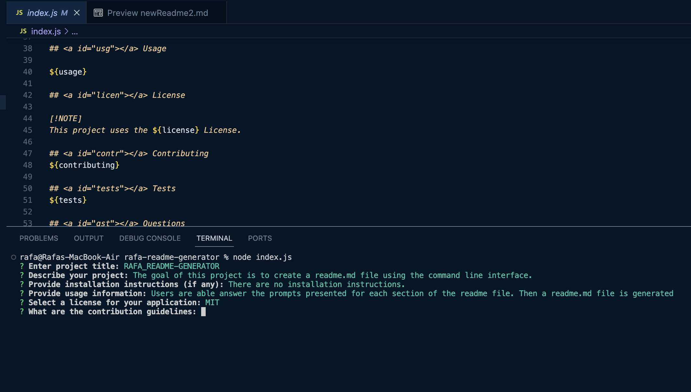
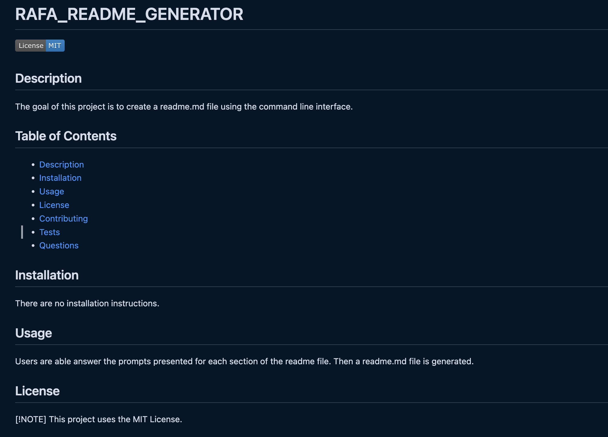

# rafa-readme-generator

## Description

The goal of this project is to create a readme.md file using the command line interface.

## Link to webpage
N/A

## Installation

N/A

## Usage

Users are able answer the prompts presented for each section of the readme file. Then a readme.md file is generated

## [Link to Video](https://drive.google.com/file/d/1-r_nAja_ABsTCj5hQo0GVrXzB7YK3zjY/view)

## Credits

N/A

## License

This project uses the MIT license

## Badges

## Features

- users are able to answer prompts.
- prompts guide the user in an orderly fashion.
- a readme file is generated in minutes.
